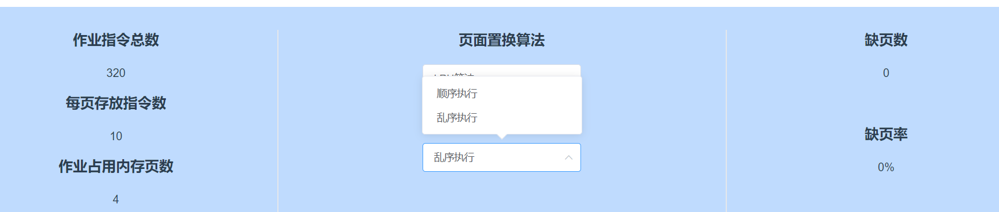
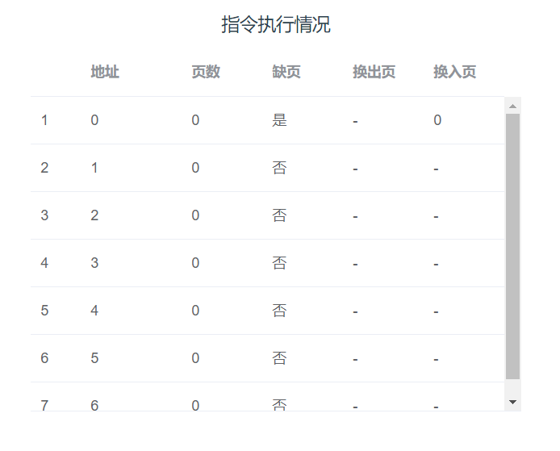
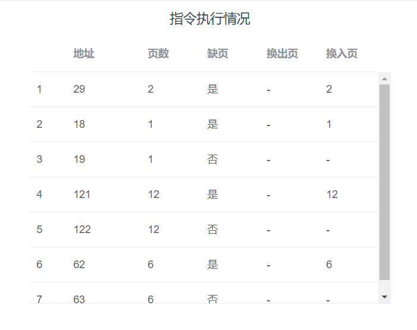
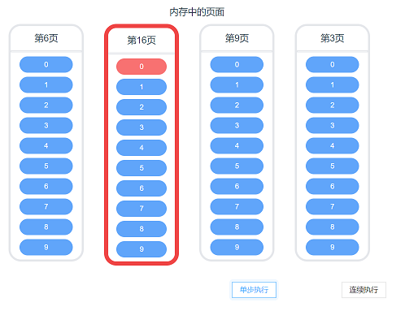
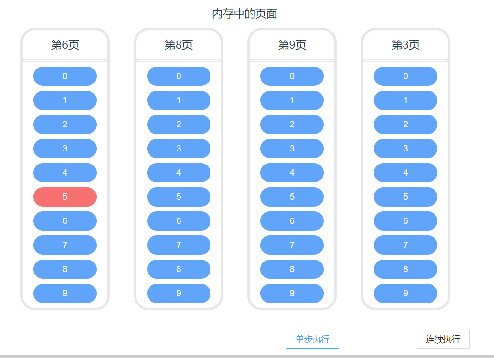
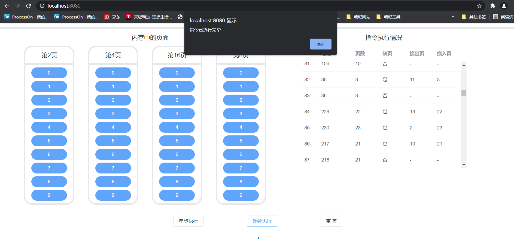
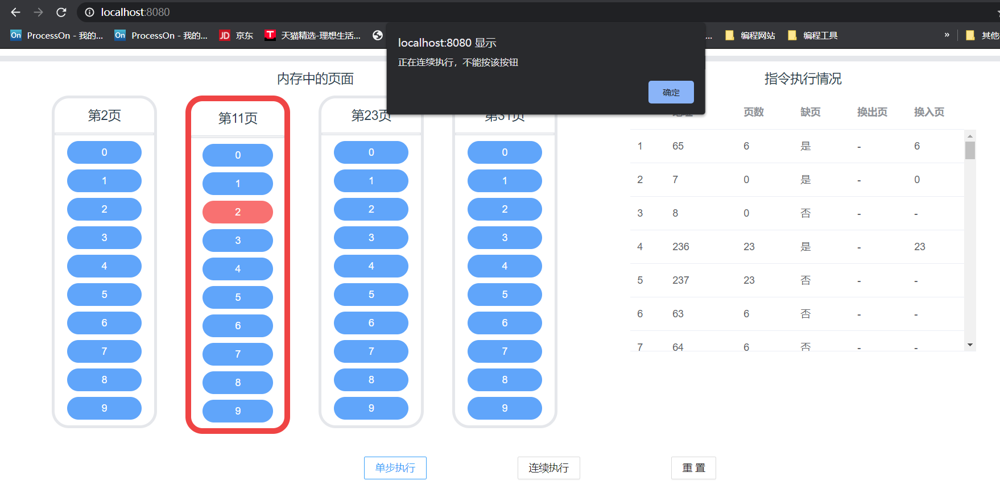
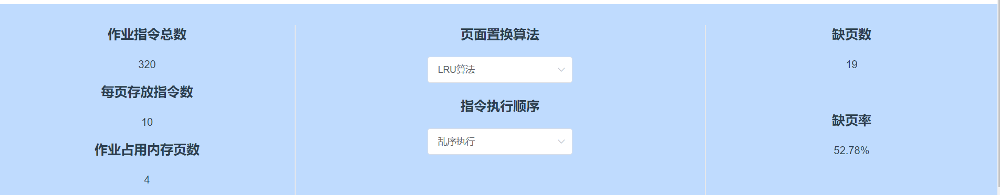
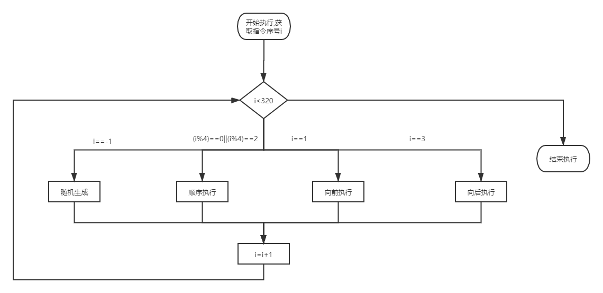
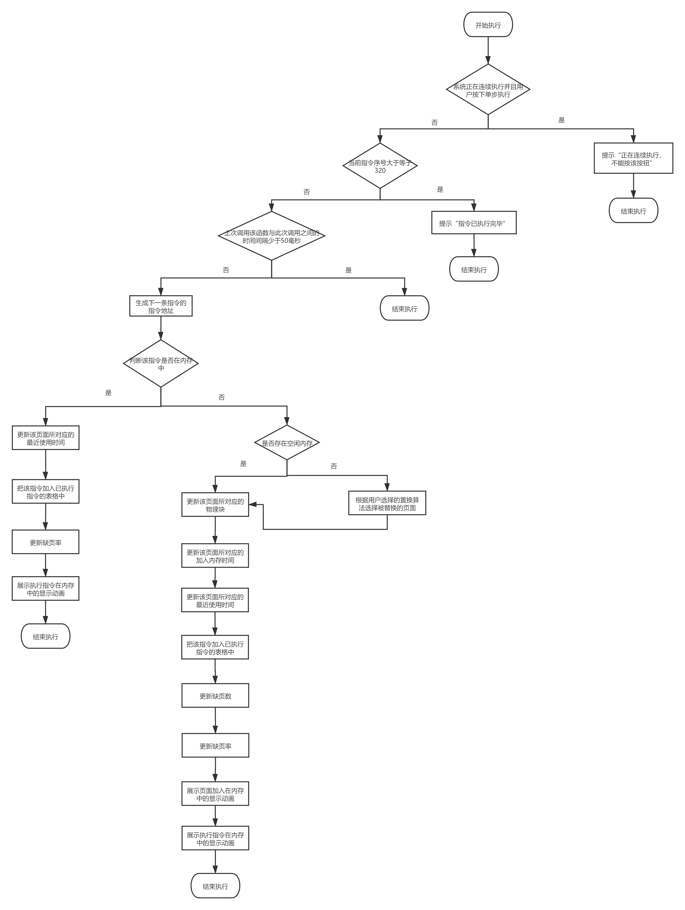

# 请求分页存储管理方式模拟

<center><font size='5'>1850061   阮辰伟</font></center>

<div style="page-break-after: always;"></div>


[Toc]

<div style="page-break-after: always;"></div>

## 项目说明

### 项目简介

本项目为请求分页存储管理方式的实现与展示。

假设每个页面可存放10条指令，分配给一个作业的内存块为4。模拟一个作业的执行过程，该作业有320条指令，即它的地址空间为32页，目前所有页还没有调入内存。

在指令执行过程中如果所访问指令在内存中，则显示其物理地址，并转到下一条指令；如果没有在内存中，则发生缺页，此时需要记录缺页次数，并将其调入内存。如果4个内存块中已装入作业，则需进行页面置换。

在指令执行过程中，需要记录并显示指令的缺页数以及缺页率。


### 项目环境

#### 开发环境

$Vue +Tailwind+Ant\ Design\ Vue+ Node.js$


#### 运行方式

方式1：直接运行

网页端直接访问：https://1850061.github.io/memory-manage/


方式2：本地运行

本项目依赖```npm```和```Vue Cli```，运行前请确保环境中已安装node.js

1. 命令行窗口进去项目文件根目录

2. 根目录下运行
   ```
   npm install
   ```
   下载项目依赖的文件包
   
3. 根目录下运行

  ```
  npm run serve
  ```

  可以在本地部署内存管理模拟的网页。完成后依照命令行界面的提示便可在浏览器中测试该模拟器，默认运行在计算机 [8080 端口](http://localhost:8080/)


### 功能描述与展示

#### 指令生成

- 系统会记录下指令执行情况的记录


- 用户可以选择执行方式，有顺序执行以及乱序执行两种执行方式



- 顺序执行



- 乱序执行




#### 指令单步执行

- 指令执行情况的会随着指令的单步执行不断更新
- 缺页数以及缺页率会随着指令执行动态更新
- 用户不可过快点击单步执行（50ms之内），若存在$click2>click1,click2-click1<50$，且$click1$点击成功，此时系统会无视$click2$
- 新换入的页面会有高亮显示



- 被执行的指令会被高亮显示



- 320条指令执行完毕后，若继续点击“单步执行”按钮，系统将提示“指令以执行完毕”，并且不继续执行




#### 指令连续执行

- 指令连续执行中，系统连续多次执行指令单步执行
- 单步执行的功能在连续执行中均有体现
- 指令连续执行时，点击“连续执行”按键，系统会停止连续执行
- 指令连续执行时，如果用户点击单步执行或者重置，系统会提示“正在连续执行，不能按该按钮”



- 320条指令执行完毕后，若继续点击“连续执行”按钮，系统将提示“指令以执行完毕”，并且不继续执行


#### 相关信息的选择与展示

- 系统会展示作业指令总数、每页存放指令数、作业占用内存页数、页面置换算法、指令执行顺序、缺页数以及缺页率等信息
- 用户可以改变页面置换算法以及指令执行顺序
- 系统会更具指令的执行情况动态及时更新缺页数以及缺页率吧




#### 项目重置

- 项目重置后内存中页面以及指令执行情况两部分内容会被清空

- 项目重置后缺页率以及缺页数会被清零


## 功能实现

### 指令生成

在决定下一条指令之前，系统会首先获取用户选择的指令生成方式，并以此为基础决定指令生成的策略。用户可以选择顺序执行以及乱序执行两种指令生成方式。

下面我列出一些指令生成方式，假设当前指令为$nowAddress$

| 执行方式 | 生成语句                                                     | 语句解释                            |
| :------: | ------------------------------------------------------------ | ----------------------------------- |
| 随机生成 | $Math.floor((Math.random() * 320))$                          | 随机生成0~319之间的地址             |
| 顺序执行 | $(nowAddress+1)\%320$                                        | 当前地址的下一个地址                |
| 向前执行 | $Math.floor((Math.random() * nowAddress))$                   | 生成地址x，满足$0\le x< nowAddress$ |
| 向后执行 | $Math.floor((Math.random() * (319 - nowAddress)) + nowAddress+1)$ | 生成地址x，满足$m< x< 320$          |


#### 顺序执行

即执行指令当前地址的下一个地址的指令，如果当前地址为$nowAddress$，下一个地址为$(nowAddress+1)\%320$。顺序执行时，第一条指令地址为0


#### 乱序执行

这里所说的指令乱序执行并非完全随机执行，而是要遵循一个原则：50%的指令是顺序执行的，25%是均匀分布在前地址部分，25％是均匀分布在后地址部分。为此，我设计了乱序执行过程中指令的生成方式以及顺序。

以下用流程图的方式展示乱序执行过程中指令地址的生成顺序



通过以上流程图我们可以看出：

如果用户从一开始就选择了乱序执行的方式，指令生成的顺序为

随即生成$\rightarrow$顺序执行$\rightarrow$向前执行$\rightarrow$顺序执行$\rightarrow$向后执行$\rightarrow$顺序执行$\rightarrow$向前执行$\rightarrow$......


代码：

```vue
...
<script>
import Memory from "@/components/memory";
import Implement from "@/components/implement";
import MyInformation from "@/components/myInformation";
import ImplementInformation from "@/components/implementInformation";


export default {
  ...
  methods: {
    ...
    decideNext: function () {
      console.log(this.$refs.information.commandOrderType)
      if (this.$refs.information.commandOrderType === '乱序执行' || this.$refs.information.commandOrderType === 'random') {
        if (this.nowAddress === -1) {
          this.nowAddress = Math.floor((Math.random() * 320));
        } else {
          if (this.stepCount % 4 === 0 || this.stepCount % 4 === 2) {
            this.nowAddress = (this.nowAddress + 1) % 320
          } else if (this.stepCount % 4 === 1) {
            this.nowAddress = (Math.floor((Math.random() * this.nowAddress))) % 320;
          } else if (this.stepCount % 4 === 3) {
            this.nowAddress = (Math.floor((Math.random() * (319 - this.nowAddress)) + this.nowAddress + 1)) % 320;
          }
        }
      } else {
        this.nowAddress = (this.nowAddress + 1) % 320
      }
      this.stepCount += 1
    }
  }
}
</script>
```


### 置换算法

在决定置换内存中一个页之前，系统会首先获取用户选择的页置换算法，并以此为基础决定页置换策略。用户可以选择FIFO以及LRU两种页置换算法。


#### FIFO

在FIFO置换算法中，我们通过pageInformation对象数组中具体对象的'inTime'属性获取该物理块进入页面的时间。选择进入页面的时间最早的那个进行替换。

需要注意的是，如果获取到属性的值为0，说明此时$pageInformation[i]['inTime']$中的值还是默认值，该页面没有任何物理块进入，应当无视这个值。


相关代码：

```vue
...
<script>
import Memory from "@/components/memory";
import Implement from "@/components/implement";
import MyInformation from "@/components/myInformation";
import ImplementInformation from "@/components/implementInformation";


export default {
  ...
  methods: {
    ...
    FIFO: function () {
      let minIndex = -1;
      let minInTime = 1000
      for (let i = 0; i < this.pageInformation.length; i++) {
        if (this.pageInformation[i]['inTime'] === 0) {
          continue
        }
        if (this.pageInformation[i]['inTime'] < minInTime) {
          minInTime = this.pageInformation[i]['inTime']
          minIndex = i
        }
      }
      return minIndex
    }
  }
}
</script>
```


#### LRU

在LRU置换算法中，我们通过useTime对象数组中具体对象的'useTime'属性获取最近一次使用页面的时间。选择使用页面最早的那个进行替换。

需要注意的是，如果获取到属性的值为0，说明此时$pageInformation[i]['useTime']$中的值还是默认值，该页面没有任何物理块进入，应当无视这个值。


相关代码：

```vue
...
<script>
import Memory from "@/components/memory";
import Implement from "@/components/implement";
import MyInformation from "@/components/myInformation";
import ImplementInformation from "@/components/implementInformation";


export default {
  ...
  methods: {
    ...
    LRU: function () {
      let minIndex = -1;
      let minUseTime = 1000
      for (let i = 0; i < this.pageInformation.length; i++) {
        if (this.pageInformation[i]['useTime'] === 0) {
          continue
        }
        if (this.pageInformation[i]['useTime'] < minUseTime) {
          minUseTime = this.pageInformation[i]['useTime']
          minIndex = i
        }
      }
      return minIndex
    }
  }
}
</script>
```


### 指令单步执行流程

下面我通过流程图的方式来展示请求分页存储管理系统中单步指令的执行逻辑。




相关代码：

```vue
...
<script>
import Memory from "@/components/memory";
import Implement from "@/components/implement";
import MyInformation from "@/components/myInformation";
import ImplementInformation from "@/components/implementInformation";


export default {
  ...
  methods: {
    step: function (fromMul = false) {
      if (this.isMultStep === 1 && fromMul === false) {
        alert('正在连续执行，不能按该按钮')
        return
      }
      if (this.stepCount >= 320) {
        alert("指令已执行完毕")
        this.sleep(this.mulTimeInterval)
        return;
      }
      if (this.lastClick === 0) {
        this.lastClick = new Date().getTime()
      } else if ((new Date().getTime() - this.lastClick) < 50) {
        return
      } else {
        this.lastClick = new Date().getTime()
      }
      this.decideNext()
      let memoryIndex = this.isInMemory()
      if (memoryIndex >= 0) {
        this.pageInformation[memoryIndex]['useTime'] = this.stepCount
        this.$refs.implement.addData(this.getData('否', ' -', ' -'))
        this.pageMissingRate = this.pageMissingNumber * 100 / this.stepCount
        this.commandAnimate(memoryIndex, this.nowAddress % 10)
        return
      }
      let zero = this.haveZero()
      if (zero >= 0) {
        this.pages[zero]['page'] = Math.floor(this.nowAddress / 10)
        this.pageInformation[zero]['inTime'] = this.stepCount
        this.pageInformation[zero]['useTime'] = this.stepCount
        this.$refs.implement.addData(this.getData('是', ' -', Math.floor(this.nowAddress / 10)))
        this.pageMissingNumber += 1
        this.pageMissingRate = this.pageMissingNumber * 100 / this.stepCount
        this.pageAnimate(zero)
        this.commandAnimate(zero, this.nowAddress % 10)
        return
      }
      if (this.$refs.information.algorithmValue === 'LRU算法' || this.$refs.information.algorithmValue === 'LRU') {
        let outPageIndex = this.LRU()
        let oldPage = this.pages[outPageIndex]['page']
        this.pages[outPageIndex]['page'] = Math.floor(this.nowAddress / 10)
        this.pageInformation[outPageIndex]['inTime'] = this.stepCount
        this.pageInformation[outPageIndex]['useTime'] = this.stepCount
        this.$refs.implement.addData(this.getData('是', oldPage, Math.floor(this.nowAddress / 10)))
        this.pageMissingNumber += 1
        this.pageMissingRate = this.pageMissingNumber * 100 / this.stepCount
        this.pageAnimate(outPageIndex)
        this.commandAnimate(outPageIndex, this.nowAddress % 10)
      } else if (this.$refs.information.algorithmValue === 'FIFO算法' || this.$refs.information.algorithmValue === 'FIFO') {
        let outPageIndex = this.FIFO()
        let oldPage = this.pages[outPageIndex]['page']
        this.pages[outPageIndex]['page'] = Math.floor(this.nowAddress / 10)
        this.pageInformation[outPageIndex]['inTime'] = this.stepCount
        this.pageInformation[outPageIndex]['useTime'] = this.stepCount
        this.$refs.implement.addData(this.getData('是', oldPage, Math.floor(this.nowAddress / 10)))
        this.pageMissingNumber += 1
        this.pageMissingRate = this.pageMissingNumber * 100 / this.stepCount
        this.pageAnimate(outPageIndex)
        this.commandAnimate(outPageIndex, this.nowAddress % 10)
      }

    }
  }
}
</script>
```


### 指令连续执行流程

在指令执行过程中，系统会首先判断所有指令是否已经执行完成，如果已经执行完成，则提示“指令已执行完毕”并退出程序。如果继续执行，就把请求分页存储管理系统会先把$isMultStep$变量更改为1，代表系统正在连续执行。此时如果按下单步执行或者重置按键，会提醒用户系统此时正在连续执行，不能点击这些按键。如果在系统正在连续执行之时再次点击连续执行按键，系统会终止连续执行。

系统连续执行过程中，通过$setInterval$函数反复调用单步执行函数$step$，直到所有指令执行完毕。

 

代码:

```vue
...
<script>
import Memory from "@/components/memory";
import Implement from "@/components/implement";
import MyInformation from "@/components/myInformation";
import ImplementInformation from "@/components/implementInformation";


export default {
  ...
  methods: {
    ...
    multStep: function () {
      if (this.stepCount >= 320) {
        alert("指令已执行完毕")
        return;
      }
      if(this.isMultStep === 1)
      {
        this.isMultStep = 0
        clearInterval(this.timer)
        return
      }
      const that = this
      this.isMultStep = 1
      that.timer = setInterval(function () {
        that.step(true)
        if (that.stepCount >= 320) {
          clearInterval(that.timer)
          this.isMultStep = 0
          alert("指令已执行完毕")
        }
      }, that.mulTimeInterval);

    }
  }
}
</script>
```


### 项目重置

在点击重置按键后，请求分页存储系统会回退到没有指令被执行且所有页还没有调入内存的状态。

就具体执行过程来说，只需要把App.vue中的pages，pageInformation以及组件implement中的tableDatade等参数调整回初值即可。

```vue
...
<script>
import Memory from "@/components/memory";
import Implement from "@/components/implement";
import MyInformation from "@/components/myInformation";
import ImplementInformation from "@/components/implementInformation";


export default {
  ...
  methods: {
    ...
    reset: function () {
      if (this.isMultStep === 1) {
        alert('正在连续执行，不能按该按钮')
        return
      }
      this.$refs.implement.reset()
      this.iniPages()
      this.pageInformation = [{inTime: 0, uesTime: 0}, {inTime: 0, uesTime: 0}, {inTime: 0, uesTime: 0}, {
        inTime: 0,
        uesTime: 0
      }]
      this.pageMissingRate = 0
      this.pageMissingNumber = 0
      this.stepCount = 0
      this.nowAddress = -1
      this.lastClick = 0
      this.isMultStep = 0
      alert("重置成功")
    }
  }
}
</script>
```


### 内存块以及指令的高亮显示控制

本项目中，我们已知内存块的编号为0 ~ 31，内存块中指令的编号为0 ~ 9。基于此，我设计了当想要使得某页面/指令显示高亮时，程序的执行步骤。下面以想要页面显示高亮为例。

1. 找到该内存块所对应的主存中页面编号
2. 给该页面表示的内存块的值加上32
3. 在展示页面的组件中展示 $(内存块的值)\%32$
4. 在展示页面的组件中检查内存块的值是否$\ge 32$，如果为真，则把此页设置为高亮，否则则不展示。


页面所对应的内存块控制字段

```vue
...
<script>
import Memory from "@/components/memory";
import Implement from "@/components/implement";
import MyInformation from "@/components/myInformation";
import ImplementInformation from "@/components/implementInformation";


export default {
  ...
  methods: {
    ...
    commandAnimate(page, command) {
      const that = this
      that.pages[page]['commands'][command] += 10
      setTimeout(function () {
        that.pages[page]['commands'][command] -= 10
      }, that.mulTimeInterval * 0.8);
    }
    ,
    pageAnimate(page) {
      const that = this
      that.pages[page]['page'] += 32
      setTimeout(function () {
        that.pages[page]['page'] -= 32
      }, that.mulTimeInterval * 0.8);
    }
  }
}
</script>

```


页面组件控制字段

```vue
<template>
  <div>
    <div v-if="isOver">
      <div v-show="page>=0" class="w-1/6 ... mx-5 ... float-left ... rounded-3xl ...
   border-solid ...  border-4 ... border-light-blue-500 ...  border-opacity-100 ... ">
        <div class="h-12 flex justify-center items-center text-lg ... ">
          第{{ page % 32 }}页
        </div>
        ...
      </div>
    </div>
    <div v-else>
      <div v-show="page>=0" class="w-1/6 ... mx-5 ... float-left ... rounded-3xl ...
   border-solid ...  border-8 ... border-red-500 ...  border-opacity-100 ... ">
        <div class="h-12 flex justify-center items-center text-lg ... ">
          第{{ page % 32 }}页
        </div>
        ...
      </div>
    </div>
  </div>
</template>

<script>

import Command from "@/components/command";

export default {
  name: "memoryStation",
  components: {Command},
  data() {
    return {}
  },
  computed: {
    // 计算属性的 getter
    isOver() {
      // `this` 指向 vm 实例
      return this.page < 32
    }
  },
  ...
}
</script>

```


指令组件控制字段：

```vue
<template>
  <div>
    <div v-if="isOverTen">
      ...
    </div>
    <div v-else>
      ...
    </div>
  </div>
</template>

<script>
export default {
  name: "command",
  computed: {
    isOverTen() {
      return this.commandIndex < 10
    }
  },
  props: {
    commandIndex: String
  }
}
</script>
```


## 项目总结

### 项目亮点

- 实现了LRU以及FIFO两种置换算法
- 用户可以选择顺序执行指令以及乱序执行指令两种执行方式，观察不同指令执行顺序下的内存变化
- 采用高亮的方式展示了当前内存中正在交换的页面以及正在执行的指令，清晰直观
- 记录了已执行指令的地址、页面、换出页、换入页等信息，能较好展示指令执行的过程
- 较好展示了作业指令总数、缺页数等等总体信息，并及时改变
- 项目会阻止用户过快点击执行、在指令全部执行完毕后依然点击执行等等错误操作，并输出提示信息


### 项目改进方向

- 加入CLOCK算法等别的页面置换算法
- 此项目界面仅针对网页端，尚未对手机端进行适配。未来开发中会考虑进一步适配手机端页面
- 增加功能，使得用户可以调整作业指令总数、作业占用内存等信息，以便展示不同指令总数、不同作业占用内存条件下的指令执行情况
